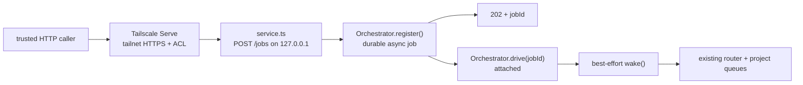
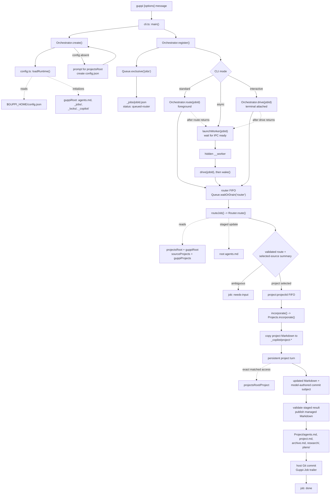
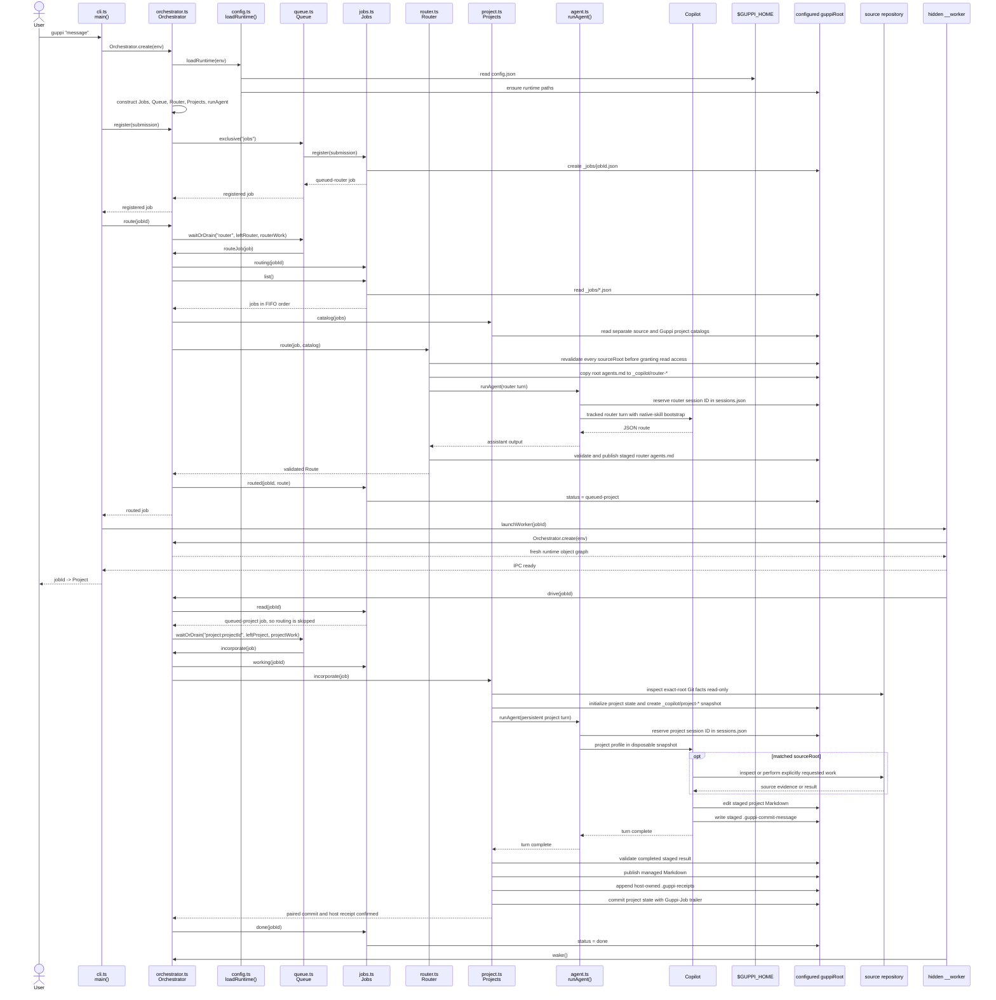

# Guppi

Guppi is a local CLI that stores one raw thought as a durable job, asks a
persistent router session which project owns it, and lets that project's
persistent session incorporate it into compact Markdown state.

## Install

Requirements:

- Node.js 22.15 or newer
- Git available as `git`
- GitHub Copilot CLI available as `copilot` and authenticated

```bash
npm install -g github:avanderhoorn/guppi
```

Git installation runs the package build and installs the compiled CLI plus its
runtime skill assets. For development from a checkout:

```bash
npm install
npm link
```

Check `command -v guppi` first if you may already have another command with that
name.

## Use

```bash
guppi "Capture the release idea"
guppi -p Alpha "This probably belongs to Alpha"
guppi -a "Queue this and return immediately"
guppi -i "Work through this with me"
guppi service
guppi status
guppi status <jobId>
```

- Standard mode routes in the foreground, starts a worker for project work,
  then prints `<jobId> -> <Project>`.
- `-a, --async` stores the job, starts a worker, and prints only the job ID.
- `-i, --interactive` keeps the terminal attached through the selected project
  turn.
- `-p, --project` is a strong hint to the router, not a forced destination.
- `service` keeps an attached loopback HTTP intake process running until its
  terminal process exits.

## Service

Start the service on its default port:

```bash
guppi service
```

It listens only on `127.0.0.1:8787` and prints its endpoint after the socket is
ready:

```text
Guppi service listening: POST http://127.0.0.1:8787/jobs
```

Choose another loopback port with `--port`; port `0` asks the operating system
for a temporary port and is primarily useful for tests.
Like other visible commands, the first service launch prompts for
`projectsRoot` when configuration is missing and both terminal streams are
interactive; a non-interactive first run fails before opening the listener.

Submit a trusted job:

```bash
curl http://127.0.0.1:8787/jobs \
  --header 'Content-Type: application/json' \
  --data '{"prompt":"Capture the release idea","projectHint":"Alpha"}'
```

`prompt` is required. `projectHint` may be omitted or `null` and remains
advisory router context. A successful response is:

```json
{"jobId":"2026-01-01T00-00-00.000Z-deadbeef"}
```

The service returns `202 Accepted` only after the normal async job is durable,
then calls `Orchestrator.drive(jobId)` in-process and requests one best-effort
backlog wake after that drive settles. It does not launch one detached worker
per request or add a service-specific job mode, queue, session, or registry. The
request body is limited to 64 KiB, must be UTF-8 JSON, and may contain only
`prompt` and `projectHint`. Requests must use `Content-Type: application/json`
with no charset or `charset=utf-8`.

Errors return one static JSON code:

| Status | Error |
| ---: | --- |
| `400` | `invalid_request` |
| `404` | `not_found` |
| `405` | `method_not_allowed` |
| `413` | `payload_too_large` |
| `415` | `unsupported_media_type` |
| `500` | `registration_failed` |

`202` proves registration, not routing or completion. Use
`guppi status <jobId>` locally to inspect the result. No response is ambiguous:
the connection may have closed while registration completed, and retrying can
create a duplicate job. `needs-input` has no HTTP continuation in this version.
Every request records the directory where the service process started as weak
routing context; callers cannot set `cwd` or `sourceRoot`.

This is unauthenticated HTTP for trusted callers and has the same effective
authority as trusted `guppi --async` input. A reachable caller can request model
research, shell commands, source edits, or external effects under the existing
project contract. Do not forward untrusted issue text, chat messages, or
third-party webhook fields directly as authorization-bearing prompts.

### Tailscale

Keep Guppi on loopback and publish it with Tailscale Serve:

```bash
# Guppi remains attached to this terminal.
guppi service --port 8787

# In another terminal, publish the loopback service to the tailnet.
tailscale serve --bg 8787

tailscale serve status
tailscale serve off
```

Tailscale may prompt once to enable tailnet HTTPS certificates. Restrict and
verify tailnet access rules so only principals trusted to submit Guppi work can
reach the Serve URL. Do not use Tailscale Funnel, which makes the endpoint
public. Guppi does not invoke Tailscale or trust its forwarded identity headers.

The `--bg` Serve configuration persists independently of Guppi, including
across Tailscale restarts. Stopping `guppi service` does not remove that
configuration; run `tailscale serve off` separately.

See the official
[Tailscale Serve command](https://tailscale.com/docs/reference/tailscale-cli/serve)
and [access-control](https://tailscale.com/docs/features/access-control)
documentation for current operator setup.



## System Flow

The following flow covers one-shot CLI intake. The job file is the handoff
between process lifetimes. Standard mode routes before returning, async mode
returns after registration and worker startup, and interactive mode keeps the
full selected project turn in the foreground. All modes and the attached service
use the same router and project queues.



## Call Sequence

This sequence follows the standard-mode success path. It shows the major
function calls and filesystem boundaries without expanding every retry,
recovery, or lock mutation.



The other modes change only who calls the same progression methods:

- Async uses `main() -> register() -> launchWorker()`, then the worker calls
  `drive() -> wake()`.
- Interactive uses `main() -> register() -> drive() -> launchWorker()`, then
  the worker calls `drive() -> wake()`. Its `drive()` returns immediately for
  the completed job.
- Standard uses `main() -> register() -> route() -> launchWorker()`, then the
  worker calls `drive() -> wake()`, as shown above.
- Service uses `main() -> startService()`. Each accepted request calls
  `register()`, returns `202`, and schedules `drive(jobId) -> wake()` in the
  attached process. Service startup also requests one best-effort `wake()` for
  existing backlog.

## Configure

The first visible command asks for the source-project root:

```text
Projects root [~/Projects]:
```

It then creates `$GUPPI_HOME/config.json`, where `GUPPI_HOME` defaults to
`~/.guppi`:

```json
{
  "version": 1,
  "projectsRoot": "~/Projects"
}
```

`projectsRoot` supplies the router with its catalog of direct child
directories. A blank answer uses `~/Projects`. A first run without an
interactive stdin and stdout fails with instructions for creating the file
manually.

The durable and operational state root can be configured separately:

```json
{
  "version": 1,
  "projectsRoot": "~/Projects",
  "guppiRoot": "~/.local/share/guppi"
}
```

`guppiRoot` is optional and defaults to `$GUPPI_HOME`. `GUPPI_HOME` remains the
stable location of `config.json`, and the first-run prompt never asks for
`guppiRoot`. The value simply selects the directory Guppi uses for state; Guppi
does not move state when it changes. Configured paths must be absolute or begin
with `~/`; root symbolic links and dangling symbolic-link components are
rejected; and `projectsRoot`, `guppiRoot`, and a distinct `GUPPI_HOME` must not
overlap.

Guppi launches Copilot with an isolated operational home under
`<guppiRoot>/_copilot`, so personal plugins, MCP servers, hooks, and custom
instructions are not loaded. Authentication environment variables and
`COPILOT_MODEL` remain available.

## State

```text
$GUPPI_HOME/
  config.json

<guppiRoot>/                 # defaults to $GUPPI_HOME
  .agents/
    skills/
  agents.md
  sessions.json
  _jobs/
  _locks/
  _copilot/
  <Project>/
    .git/
    .guppi-receipts
    agents.md
    project.md
    archive.md
    research/
    plans/
```

The authoritative raw submission exists only in `_jobs/<jobId>.json`. Copilot's
operational transcripts under `_copilot/` may also contain prompts, but they are
cacheable provider state rather than Guppi project memory. Durable project
meaning lives in the project Markdown.

Each project directory is a host-managed local Git repository. Guppi creates a
baseline commit when the project is initialized, checkpoints existing dirty
managed state before a new job, and commits the completed job before marking it
done. The project model supplies the final commit subject through its disposable
`.guppi-commit-message`; Guppi appends the exact `Guppi-Job: <jobId>` trailer.
The transient file is never published or committed. This history covers Guppi
state only and never commits the matched source repository.

Project `agents.md` contains only durable project-scoped guidance for future
model turns. Guppi owns `.guppi-receipts` as operational completion evidence;
the file is committed for audit and recovery but is never model-editable.

On first runtime initialization, Guppi copies the shipped
`share/guppi-home/.agents/` tree into the Guppi-managed
`<guppiRoot>/.agents/` directory without overwriting an existing tree.

Router and project prompts contain only a small bootstrap plus the existing
JSON input. Copilot loads the profile's primary skill from the installed
`<guppiRoot>/.agents/skills/<skill>/` directory through its native `skill` tool;
skill contracts and optional project templates are not embedded in prompts.
Native skill discovery is additive, so Copilot may also expose user or built-in
skills; Guppi requires the profile's primary skill first.
Every fresh or resumed turn instructs Copilot to invoke that primary skill
before continuing. Interactive turns use the same native discovery and
bootstrap.

Router turns receive `projectsRoot`, `guppiRoot`, separate `sourceProjects` and
`guppiProjects` arrays, the staged `routerMemoryPath`, and read tools for the
exact revalidated source roots. The router skill limits inspection to one
bounded source glance when useful and may update only that staged `agents.md`;
it must not inspect or edit durable `<guppiRoot>/agents.md`. Guppi validates the route before
publishing that memory and requires one structurally valid summary for a newly
selected source project. A retry receives the host-sanitized prior validation
or recovery error so it can repair an actionable staged-file/response failure,
or rerun the current contract after an owner exit, instead of blindly repeating
the same turn.

Each project job uses one persistent project turn. When a source project is
matched, that same turn can inspect it and perform source work explicitly
requested by the raw input. The prompt also includes bounded read-only facts for
the exact current Git worktree, including dirty paths and relation to the local
`origin/main` ref; Guppi never fetches or treats that ref as remote freshness.
Guppi-state writes still happen in disposable workspaces, and Guppi publishes
only router memory and managed project Markdown.
A project job completes only when the current project commit contains both the
exact `Guppi-Job` trailer and exactly one matching `.guppi-receipts` entry.
Recovery can finish a published-but-uncommitted receipt without replaying the
model. During one-time migration, a strict legacy receipt in committed
`agents.md` may prove an existing completion only when that commit has no
`.guppi-receipts`; Guppi migrates the working state without replay, and the next
normal checkpoint commits the new receipt file.

Project Copilot turns run with `--yolo`. Non-interactive turns also disable
`ask_user`; interactive project turns keep it available. Router turns do not use
`--yolo`: their current CLI tool names are explicitly filtered, and write
permission is scoped to the staged router-memory file. Both profiles explicitly
allow the `skill` tool and point it at their installed primary skill directory.
Project skill contracts still own source-action boundaries, while Guppi's host
validation controls only what is published as durable Guppi state.

Guppi installs no daemon. Detached workers drain one-shot CLI backlog, while
`guppi service` is an explicitly attached process that drives its accepted jobs
and wakes available startup backlog. If an unrelated worker exits before taking
a lock and no later request or command occurs, that job still waits for another
wake.

Stopping the service immediately stops intake and its process. Tracked launch
gates attempt to stop active Copilot or mutating Git children, but Guppi cannot
roll back partial source edits or external effects. The service startup
directory is weak routing context for every request in that process.
Non-interactive turns retry at most three times. Interactive project work gets
one terminal-owned attempt.

## Runtime Map

| File | Owner |
| --- | --- |
| `src/cli.ts` | CLI modes, worker startup, output |
| `src/service.ts` | Loopback HTTP intake, validation, attached job progression |
| `src/orchestrator.ts` | Registration, routing, project progression, recovery |
| `src/router.ts` | Route validation, source-summary proof, router-memory publication |
| `src/project.ts` | Project identity, source handoff, staged state publication |
| `src/agent.ts` | Copilot profiles, sessions, isolation, child lifecycle |
| `src/git.ts` | Project commits/proof and read-only source Git facts |
| `src/process.ts` | Shared tracked local child execution |
| `src/jobs.ts` | Raw-once job registry and lifecycle |
| `src/queue.ts` | Cross-process locks, waiting, draining |
| `src/config.ts` | Runtime paths and configuration |

Run `npm test` for the integration suite.
